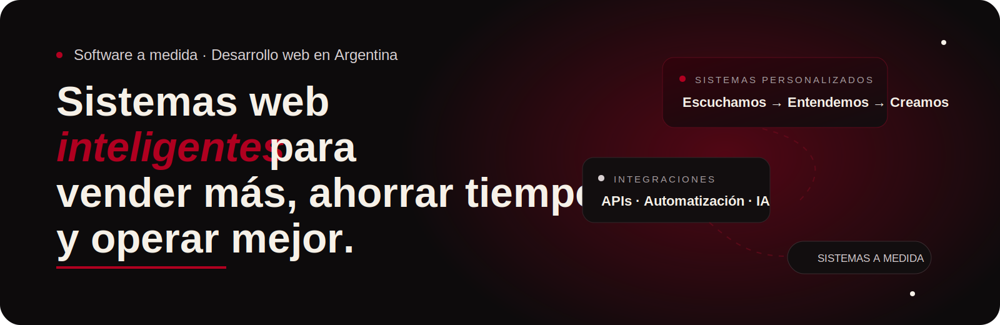
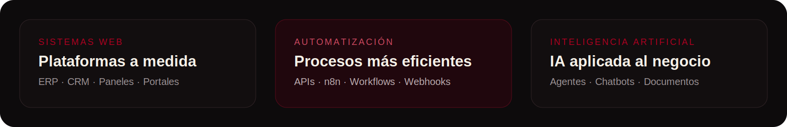

<div align="center">


<br><br>



<br>

<a href="https://vintic.com.ar">
  
</a>


</div>

<br>

## Escuchamos → Entendemos → Creamos

En **VINTIC** desarrollamos sistemas web, plataformas empresariales y automatizaciones creadas alrededor de la forma en que trabaja cada organización.

Transformamos procesos complejos en herramientas digitales simples, seguras y escalables, orientadas a mejorar la gestión, reducir tareas repetitivas y generar valor real para el negocio.

> No adaptamos tu empresa a un software genérico. Creamos el software alrededor de tu empresa.

<br>



<br>

## Qué construimos

<table>
<tr>
<td width="33%" valign="top">

### Sistemas web

- Sistemas administrativos
- Plataformas de gestión
- ERP y CRM personalizados
- Portales para clientes
- Paneles operativos
- Herramientas internas

</td>
<td width="33%" valign="top">

### Automatización

- Integraciones mediante API
- Flujos de trabajo con n8n
- Webhooks
- Sincronización de datos
- Notificaciones automáticas
- Procesos en segundo plano

</td>
<td width="33%" valign="top">

### Inteligencia Artificial

- Agentes de IA
- Asistentes empresariales
- Chatbots
- Procesamiento documental
- Integraciones con modelos de lenguaje
- Automatización asistida por IA

</td>
</tr>
</table>

<br>

## Stack tecnológico

<p align="center">
  
</p>

<br>

## Nuestra forma de trabajar

```text
Escuchamos
     ↓
Entendemos el negocio
     ↓
Diseñamos la solución
     ↓
Desarrollamos
     ↓
Implementamos
     ↓
Medimos y mejoramos
```

Cada proyecto comienza con una comprensión profunda del negocio, sus procesos y sus objetivos. A partir de eso, definimos una solución sostenible, mantenible y preparada para crecer.

<br>

## Principios

- **Software a medida:** cada solución responde a necesidades reales.
- **Seguridad desde el diseño:** protegemos datos, usuarios y operaciones.
- **Arquitecturas escalables:** construimos pensando en la evolución.
- **Experiencias simples:** reducimos complejidad para el usuario.
- **Automatización útil:** optimizamos tareas que consumen tiempo.
- **Acompañamiento continuo:** el producto evoluciona junto al negocio.

<br>

## Sectores

Logística · Distribución · Comercio · Industria · Construcción · Servicios profesionales · Salud · Educación

<br>

<a href="https://vintic.com.ar">
  
</a>

<br>

<div align="center">


**Sistemas web inteligentes para vender más, ahorrar tiempo y operar mejor.**

[vintic.com.ar](https://vintic.com.ar)

</div>
